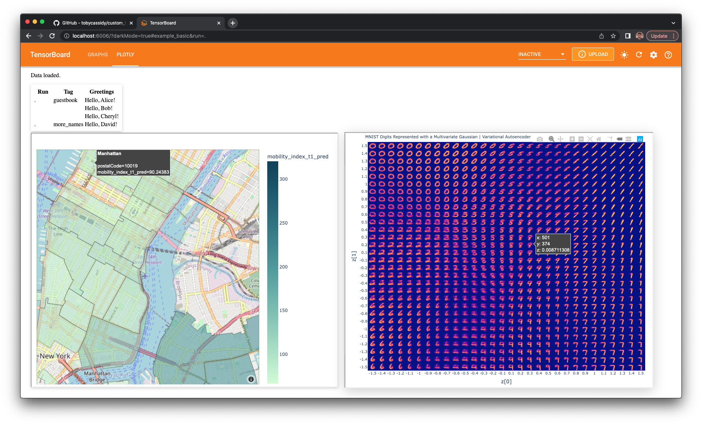

# custom_tensorboard_plugin

The goal is to write data summaries (as protocol buffers) with a Python backend and retrieve this data
via some frontend tooling (in this case, JavaScript) and render Plotly figures. Note this only requires 
an ES module that is an entry point to your frontend i.e. does not impose any framework/tool requirements
(you can use React, Vue.js, jQuery, DOM API, or whatever your favourite is etc.).

#### Custom PLOTLY Plugin

[Writing some demo summaries](https://github.com/tobycassidy/custom_tensorboard_plugin/blob/main/tensorboard_plugin_example/demo.py)

[The custom plugin class](https://github.com/tobycassidy/custom_tensorboard_plugin/blob/main/tensorboard_plugin_example/plugin.py)

[The ES module entry point](https://github.com/tobycassidy/custom_tensorboard_plugin/blob/main/tensorboard_plugin_example/static/index.js)




#### Custom Plugin Setup (list of linux commands) 

```linux

(TB_plugin38) tobycassidy@Tobys-MacBook-Pro custom_tensorboard_plugin % python setup.py develop
...
running egg_info
creating tensorboard_plugin_example.egg-info
writing tensorboard_plugin_example.egg-info/PKG-INFO
writing dependency_links to tensorboard_plugin_example.egg-info/dependency_links.txt
writing entry points to tensorboard_plugin_example.egg-info/entry_points.txt
writing top-level names to tensorboard_plugin_example.egg-info/top_level.txt
writing manifest file 'tensorboard_plugin_example.egg-info/SOURCES.txt'
reading manifest file 'tensorboard_plugin_example.egg-info/SOURCES.txt'
writing manifest file 'tensorboard_plugin_example.egg-info/SOURCES.txt'
...

```

```linux 

(TB_plugin38) tobycassidy@Tobys-MacBook-Pro custom_tensorboard_plugin % python tensorboard_plugin_example/demo.py

```

```linux

(TB_plugin38) tobycassidy@Tobys-MacBook-Pro custom_tensorboard_plugin % tensorboard --logdir=demo_logs

```

#### Example of existing plugins (without callbacks)

[GRAPHS](https://github.com/tobycassidy/custom_tensorboard_plugin/blob/main/existing_plugins/graphs/demo.py)


[PROJECTOR](https://github.com/tobycassidy/custom_tensorboard_plugin/blob/main/existing_plugins/projector/demo.py)


#### Example of existing plugins (with callbacks)

[TIME SERIES, SCALARS, GRAPHS, DISTRIBUTIONS, HISTOGRAMS, PROFILE](https://github.com/tobycassidy/custom_tensorboard_plugin/blob/main/existing_plugins/profile/demo.py)


